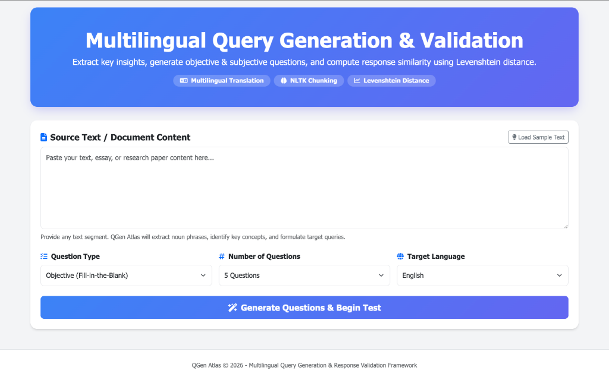
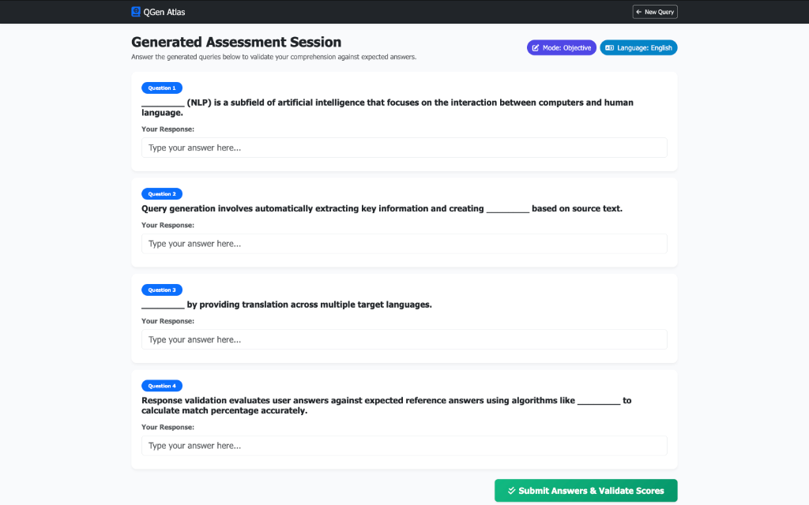

# 🧠 QGen Atlas - Multilingual Query Generation & Response Validation

[](https://qgen-atlas.onrender.com/)
[](https://www.python.org/)
[](https://flask.palletsprojects.com/)
[](https://www.nltk.org/)
[](https://qgen-atlas.onrender.com/)
[](https://qgen-atlas.onrender.com/)

An advanced end-to-end Natural Language Processing (NLP) web application and assessment platform designed for automated query generation (objective & subjective) from source text, multi-language translation, and tri-engine response validation.

🔗 **Live Application URL**: [https://qgen-atlas.onrender.com/](https://qgen-atlas.onrender.com/)

---

## 🖼️ Application Interface & Screenshots

### 1. Multilingual Query Generator Dashboard Interface


### 2. Generated Assessment Session Interface


---

## 📌 Project Overview & Objectives

In modern educational, research, and technical domains, manually constructing comprehension tests and validating user answers is time-consuming and restricted across linguistic boundaries. **QGen Atlas** solves these challenges by combining syntactic parsing, part-of-speech (POS) tagging, regexp chunking, and multi-engine response evaluation into a unified web-based solution:

1. **Multiple Choice Questions (MCQ Generation)**: Syntactically extracts key noun phrases as target answers and dynamically generates 3 distinct contextual distractors to form 4-option multiple choice questions (`Option A`, `Option B`, `Option C`, `Option D`).
2. **Objective Query Generation (Fill-in-the-Blank)**: Syntactically parses source text, extracts key noun phrases, and masks target terms with blanks (`________`) while preserving expected answer keys.
3. **Subjective Conceptual Query Generation**: Identifies subject entities across sentences and formulates conceptual questions paired with ground-truth contextual reference answers.
4. **Multilingual Translation Module**: Automatically translates generated questions, options, and answer keys into target languages (Spanish, French, German, Hindi, Tamil, Telugu, Chinese, Japanese, Arabic, Russian, Portuguese, Italian).
5. **Tri-Engine Response Validation Architecture**:
   - **MCQ Engine**: Binary option ID matching ($100\%$ Correct vs $0\%$ Incorrect).
   - **Objective Engine**: String distance normalization with numeric word equivalence (e.g. `23` $\leftrightarrow$ `twenty-three`).
   - **Subjective Engine**: Hybrid scoring combining semantic similarity, entity coverage, and factual/antonym contradiction penalties ($0\%$ for opposite facts like `violence` vs `non-violence`).

---

## 🔬 Core Architecture & Methodology

```
                     ┌───────────────────────────────┐
                     │     Raw Text Input Document   │
                     └───────────────┬───────────────┘
                                     │
                        Sentence & Word Tokenization
                                     │
                     ┌───────────────┴───────────────┐
                     │   NLTK POS Tagging & Chunking │
                     │   Grammar: NP: {<DT>?<JJ>*<NN.*>+}
                     └───────────────┬───────────────┘
                                     │
           ┌─────────────────────────┼─────────────────────────┐
           ▼                         ▼                         ▼
┌────────────────────┐    ┌────────────────────┐    ┌────────────────────┐
│   MCQ Generator    │    │ Objective Engine   │    │ Subjective Engine  │
│ Categorical        │    │ Noun Phrase        │    │ Aligned Q&A Units  │
│ Distractor Set     │    │ Blank Masking      │    │ Quality Filtered   │
└──────────┬─────────┘    └──────────┬─────────┘    └──────────┬─────────┘
           │                         │                         │
           └─────────────────────────┼─────────────────────────┘
                                     │
                     Multilingual Translation Engine
                        (GoogleTranslator Batch)
                                     │
                     Interactive Assessment Session
                                     │
                     Tri-Engine Validation Pipeline
                     (Binary / Numeric / Semantic & Contradiction)
```

---

## 📏 Response Validation Algorithm

The response validation engine applies mode-specific evaluation pipelines:

### 1. MCQ Validation Engine
$$\text{Score} = \begin{cases} 100.0\% & \text{if } \text{Selected Option ID} = \text{Correct Option ID} \\ 0.0\% & \text{otherwise} \end{cases}$$

### 2. Objective & Subjective Validation Engine
$$\text{Levenshtein Similarity} = \max\left(0.0, \left(1 - \frac{d(a, b)}{\max(\text{len}(a), \text{len}(b))}\right) \times 100\right)$$

$$\text{Final Score} = \text{Levenshtein} \times \text{Numeric Equivalence Penalty} \times \text{Contradiction Penalty}$$

### Feedback Classification Matrix

| Similarity Percentage | Qualitative Grade | Status Badge |
| :---: | :---: | :---: |
| **$\ge 85.0\%$** | **Excellent** | `Success` |
| **$65.0\% - 84.9\%$** | **Good** | `Info` |
| **$40.0\% - 64.9\%$** | **Partial Match** | `Warning` |
| **$< 40.0\%$** | **Incorrect** | `Danger` |

---

## 🌐 Multilingual Support (13+ Supported Languages)

QGen Atlas translates both generated queries and expected answer keys across diverse linguistic preferences:

| Language Code | Language Name | Language Code | Language Name |
| :---: | :---: | :---: | :---: |
| `en` | **English** (Default) | `zh-CN` | **Chinese (Simplified)** |
| `es` | **Spanish** | `ja` | **Japanese** |
| `fr` | **French** | `ar` | **Arabic** |
| `de` | **German** | `ru` | **Russian** |
| `hi` | **Hindi** | `pt` | **Portuguese** |
| `ta` | **Tamil** | `it` | **Italian** |
| `te` | **Telugu** | | |

---

## 🚀 Quickstart Guide (Local Execution)

### 1. Clone the Repository
```bash
git clone https://github.com/samuel-mekala/QGen-Atlas.git
cd QGen-Atlas
```

### 2. Set Up Virtual Environment & Install Dependencies
```bash
python3 -m venv .venv
source .venv/bin/activate
pip install -r requirements.txt
```

### 3. Launch Local Web Application
```bash
python3 app.py
```
Open your web browser and navigate to: **`http://127.0.0.1:5001/`**

---

## 🧪 Verification & Module Testing

To run the automated verification suite covering tokenization, question generation, translation batching, and Levenshtein similarity:

```bash
PYTHONPATH=. .venv/bin/python3 -c "
from objective import ObjectiveTest
from subjective import SubjectiveTest
from validation import evaluate_response

text = 'Natural Language Processing enables computers to understand human languages.'
obj = ObjectiveTest(text, num_questions=1).generate_questions()
sub = SubjectiveTest(text, num_questions=1).generate_questions()
eval_res = evaluate_response('NLP enables computers to understand languages.', text)

print('Objective Question:', obj[0]['question'])
print('Subjective Question:', sub[0]['question'])
print('Validation Score:', eval_res['similarity_percentage'], '%')
"
```

---

## 🌐 Production Cloud Deployment Guide

### Deploying to Render.com (1-Click Setup)

1. Log in to [Render.com](https://render.com/) with your GitHub account.
2. Click **New + ➔ Web Service** and select `samuel-mekala/QGen-Atlas`.
3. Fill in the build settings:
   - **Environment**: `Python 3`
   - **Build Command**: `pip install -r requirements.txt`
   - **Start Command**: `gunicorn app:app`
   - **Instance Type**: `Free`
4. Click **Create Web Service**. Render will build and deploy your application automatically.

---

## 📁 Repository File Structure

```
QGen-Atlas/
├── app.py                            # Flask web application & API route handlers
├── mcq.py                            # MCQTest class (Multiple choice question & distractor generation)
├── objective.py                      # ObjectiveTest class (NLTK POS tagging & chunking fill-in-blanks)
├── subjective.py                     # SubjectiveTest class (Concept extraction & pattern queries)
├── BERT_translate_custom.py          # Multilingual translation engine (GoogleTranslator batch API)
├── validation.py                     # Levenshtein distance string similarity scoring engine
├── requirements.txt                  # Production Python dependencies (Flask, NLTK, deep-translator, Levenshtein)
├── Procfile                          # Production process config for Gunicorn deployment
├── .gitignore                        # Git exclusion rules (.venv, nltk_data, __pycache__)
├── static/
│   └── images/
│       ├── app_form.png              # Screenshot 1: Web Application Dashboard Form Interface
│       └── app_quiz.png              # Screenshot 2: Generated Assessment Session Interface
├── templates/
│   ├── index.html                    # Main dashboard form interface (Bootstrap & Volt theme)
│   ├── quiz.html                     # Interactive assessment test-taking interface
│   └── results.html                  # Response validation scorecard & Levenshtein metrics
└── README.md                         # Comprehensive project documentation
```

---

## 📜 Author & Acknowledgments

- **Author**: Sri Hari Priya Panchumarthi **Samuel Mekala**
- **Live Application**: [https://qgen-atlas.onrender.com/](https://qgen-atlas.onrender.com/)
